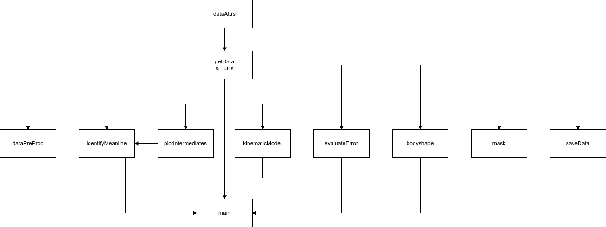

# Simultaneous Flow Measurement and Deformation Tracking for Passive Flow Control Experiments involving Fluid-Structure Interactions

## Abstract

This repository contains the python scripts that segment PIV footage of a NACA foil and analyze its deformation. Additionally, in the near future a small segment of the footage is included for method verification as well as a setup file for the python environment.

The code is in an early development stage and underwent heavy refactorization from the previous version ([DOI](https://doi.org/10.24352/UB.OVGU-2022-085)).

The masking process is governed by `main.py`, with functionality divided into individual modules.

## Description of the Contained Data

Python Scripts used in the masking process, the order of the modules from left to right in the graph is representative of the order is is called by `mask.py`.

Description:

- `_utils.py`
  - Provide low-level functions
- `dataAttrs.py`
  - Provides data structure for all parameters used throughout the code.
- `getData.py`
  - Inherits from dataAttrs and provides functionality to access the measuremt data: high-speed film in .cine format and feedback of pitch angle from the motor resolver in .dat format.
- `dataPreProc.py`
  - Denoise the images etc.
- `identifyMeanline.py`
  - Generates meanlines from a body present in the PIV images
- `plotIntermediates.py`
  - plot the intermediate steps of segmentation, used to keep the code in `identifyMeanline.py` more concise and readable
- `kinematicModel.py`
  - Introduce assumptions about the data like the bending behaviour and low-pass filtering using a certain cut-off value
- `evaluateError.py`
  - Evaluate the error, if ground truth data exists
- `bodyshape.py`
  - Draw the body around the retrieved meanline in our case a (0,0,1,8) 4-digit NACA foil.
- `mask.py`
  - Mask the images using the body from the previous step as a mask
- `saveData.py`
  - Provides methods for saving the data
- `main.py`
  - Governs the process, iterates through the images

## Necessary variables

`GetData` needs the attributes `data_folder`, `cine_file`, `angle_file` and `pivot_point` to be set and the `init()` method to be called.

Other important attributes are `stop_frame`, `evaluate_error` and `conv_diam`.

## PIV Analysis

`make_piv.py` initializes FluidImage with a set of parameters and provides the method `compute_piv()` to run the analysis.
